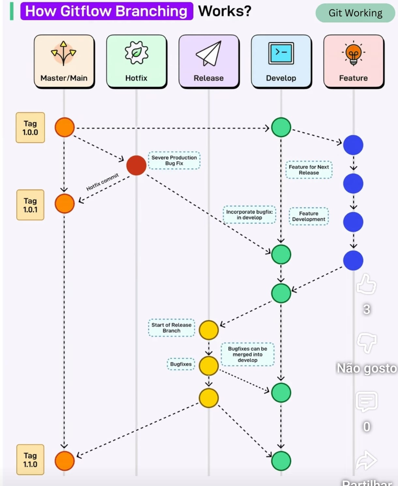

# Git Flow Operation — TodoList App (Guia Prático)

## 🔀 Git Flow (Fluxo de Trabalho com Git)

### O que é Git Flow?

**Git Flow** é um modelo de organização de branches que define **regras claras** para:

* desenvolvimento
* correções
* releases
* hotfixes

O objetivo é:

> Manter o código organizado, previsível e seguro ao longo do ciclo de vida da aplicação.

**No TodoList App:** até agora trabalhámos com uma única branch (`main`) e, na Sessão 2, com branches de feature soltas. O Git Flow organiza isso num processo repetível — o mesmo que qualquer equipa real usa para lançar versões sem quebrar produção.

---

## Branches principais no Git Flow

| Branch      | Função                         |
| ----------- | ------------------------------ |
| `main`      | Código em produção             |
| `develop`   | Código em desenvolvimento      |
| `feature/*` | Novas funcionalidades          |
| `release/*` | Preparação de versões          |
| `hotfix/*`  | Correções urgentes em produção |

---

## Visão geral do fluxo

```text
feature/* → develop → release/* → main -> tag/*
                                   ↑
                                hotfix/*
```

* **Nunca** se desenvolve diretamente em `main`
* Toda mudança deve passar por **review + pipeline**
* `main` representa sempre código pronto para produção



---

## Exemplo prático de Git Flow

### Cenário

Vamos desenvolver a funcionalidade **prioridade das tarefas** (`priority` em cada tarefa: baixa/média/alta) e lançar a versão `v1.0.0` do TodoList App.

---

### 1️⃣ Criar branch de desenvolvimento

```bash
git checkout -b develop
```
```bash
git push -u origin develop
```

`develop` será a base de todas as features.

---

### 2️⃣ Criar uma feature

```bash
git checkout develop
```
```bash
git checkout -b feature/task-priority
```

Alterar o código (adicionar um comentário `// TODO: campo priority` em `src/routes/tasks.js`, a marcar onde a funcionalidade vai entrar), depois:

```bash
git add .
```

```bash
git commit -m "feat: prepara campo priority nas tarefas"
```
```bash
git push -u origin feature/task-priority
```

---

### 3️⃣ Merge da feature para develop (via Pull/Merge Request)

No GitHub:

* Criar **Pull Request**
* `feature/task-priority` → `develop`
* Revisão de código
* Pipeline CI executa

**Aqui entram (ver Sessões 5–9):**

* SAST (SonarQube)
* testes
* lint

---

### 4️⃣ Criar branch de release

Quando o conjunto de features está pronto:

```bash
git checkout develop
```
```bash
git pull
```
```bash
git checkout -b release/1.0.0
```

Nesta fase:

* apenas correções
* ajuste de versões
* documentação

Alterar `package.json`, incrementando `"version": "1.0.0"`, depois:

```bash
git add . && git commit -m "feature: prepara release 1.0.0"
```
```bash
git push -u origin release/1.0.0
```

---

### 5️⃣ Merge da release para main (produção)

No GitHub:

* Pull Request
* `release/1.0.0` → `main`
* Pipeline CI/CD executa

Depois do merge:

TAG: é um ponteiro para uma versão do repositório.
```bash
git tag v1.0.0
```
```bash
git push origin v1.0.0
```

**A tag dispara o CI/CD** (ex.: build da imagem Docker e deploy — ver Sessão 4 e Sessão 9).

---

### 6️⃣ Sincronizar main de volta para `develop`

```bash
git checkout develop
```
```bash
git merge main
```
```bash
git push origin develop
```

Garante que `develop` contém tudo o que está em produção.

---

## Hotfix (correção urgente em produção)

### Cenário

Bug crítico encontrado em produção (`main`): uma tarefa de outro utilizador consegue ser vista por IDOR (ver Exercício 6 da Sessão 1).

```bash
git checkout main
```
```bash
git pull
```
```bash
git checkout -b hotfix/fix-task-idor
```

Corrigir o bug, alterando `src/routes/tasks.js`, depois:

```bash
git add . && git commit -m "fix: valida owner_id antes de devolver a tarefa"
```
```bash
git push -u origin hotfix/fix-task-idor
```

Depois:

* Merge para `main` (no GitHub)
* Tag `v1.0.1`:

```bash
git tag v1.0.1
```

* Push da tag `v1.0.1` para o repositório:

```bash
git push origin v1.0.1
```

* Merge também para `develop` e push:

```bash
git checkout develop
git pull
git merge hotfix/fix-task-idor
git push origin develop
```

---

## Git Flow e DevSecOps

### Porque Git Flow ajuda na segurança?

* Obriga à utilização de **Pull Requests**
* Facilita:
  * revisão de código
  * execução de SAST/DAST
  * bloqueio de código inseguro
* Protege a branch `main`

**Sem Git Flow, não há DevSecOps estruturado.**

---

## Resumindo

* `main` → produção
* `develop` → integração contínua
* `feature/*` → desenvolvimento
* `release/*` → estabilização
* `hotfix/*` → urgências

---

## Exercícios Práticos

1. Criar a branch `develop` a partir da `main` e enviá-la para o GitHub
2. Criar `feature/task-priority`, fazer uma pequena alteração e abrir Pull Request para `develop`
3. Criar `release/1.0.0` a partir da `develop`, ajustar a versão e abrir Pull Request para `main`
4. Criar a tag `v1.0.0` depois do merge e sincronizar `develop` com `main`
5. Simular um hotfix (`hotfix/fix-task-idor`) a partir da `main`, com tag `v1.0.1` e merge de volta para `develop`

---

## Documentação oficial

* Git Flow (modelo original):
  [https://nvie.com/posts/a-successful-git-branching-model/](https://nvie.com/posts/a-successful-git-branching-model/)
* Git Branching (Git Book):
  [https://git-scm.com/book/en/v2/Git-Branching-Branching-Workflows](https://git-scm.com/book/en/v2/Git-Branching-Branching-Workflows)
* GitHub Flow (comparação):
  [https://docs.github.com/en/get-started/quickstart/github-flow](https://docs.github.com/en/get-started/quickstart/github-flow)
